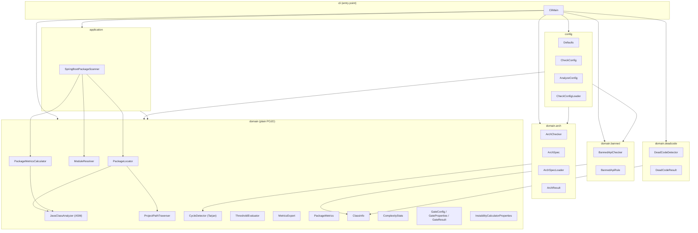
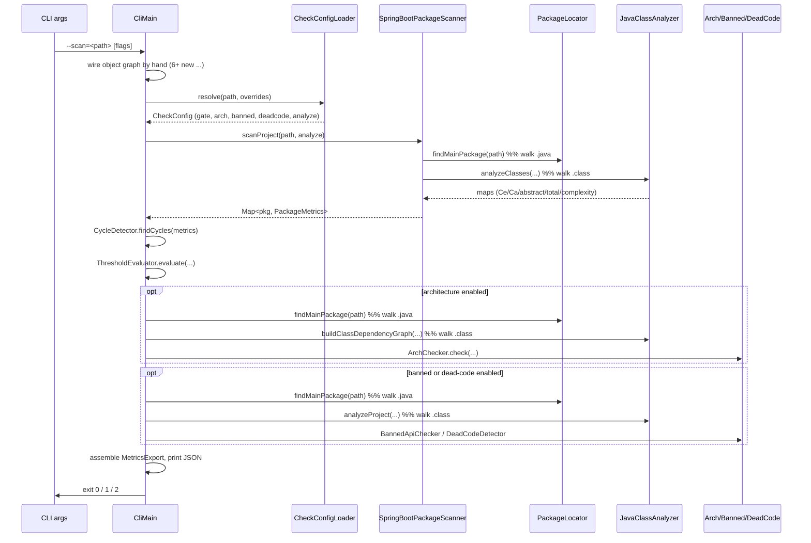
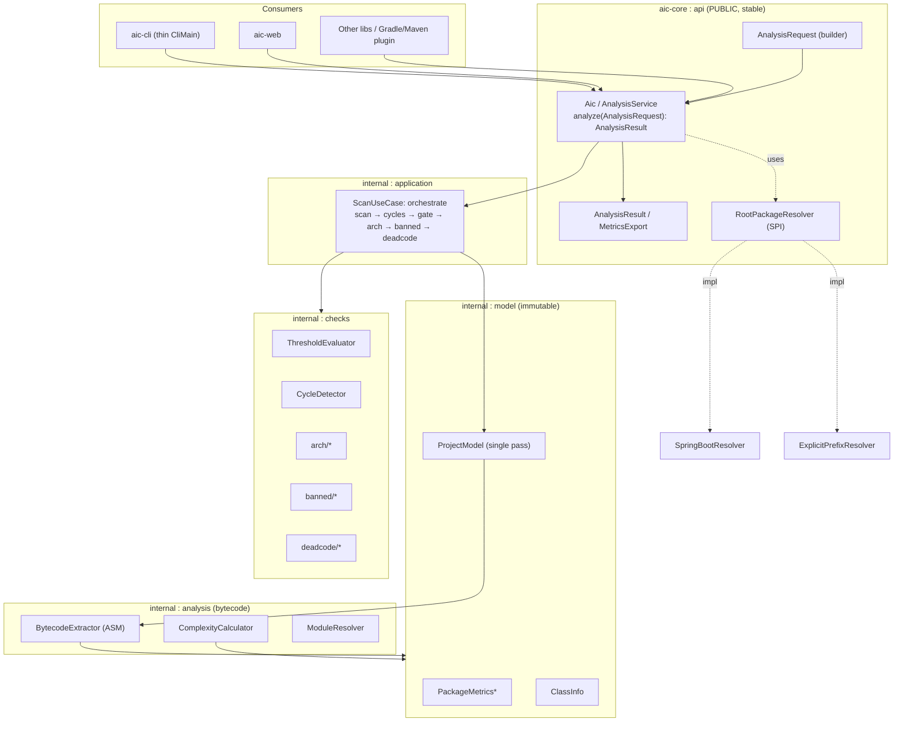

# `aic-core` Architecture Review

> Architecture review of the `aic-core` module — the Spring-free bytecode analysis engine of the **aic** project.
> Scope: the `core/` module only (not `web/`). Evaluated against **library design standards**, since `aic-core` is shipped both as a library (`aic-core`) and as a CLI (`aic-cli.jar`).
>
> Date: 2026-06-16 · Vietnamese version: [`aic-core-architecture-review.md`](./aic-core-architecture-review.md)

---

## 1. Executive summary

`aic-core` is a package-metrics analysis engine (Robert Martin's package metrics) that reads `.class` bytecode directly via ASM, with **no Spring dependency**. The foundation is **solid**: clear layering, pure-logic classes that are easy to test, immutable result records, and layered configuration (defaults < project yaml < CLI flags).

However, **measured against the standards of a public library**, several things are not yet right before `aic-core` can truly be "consumed as a lib": there is **no stable public API facade**, the `groupId/package` is still the placeholder `com.example` (not publishable), `JavaClassAnalyzer` is a **God class**, it **mixes reading `.java` source** with **reading bytecode**, it is **hardcoded to Spring Boot**, and the engine **scans the whole project multiple times** (3 ASM walks + several main-package lookups).

| Aspect | Rating |
|---|---|
| domain/application/cli layering | 🟢 Good |
| Pure logic is testable | 🟢 Good |
| Immutability of results | 🟡 Partial (records good, but `PackageMetrics` is mutable) |
| Public API for lib consumers | 🔴 No facade, must wire by hand |
| Coordinates/metadata for publishing | 🔴 `com.example`, missing POM metadata |
| Single Responsibility | 🔴 `JavaClassAnalyzer` overloaded |
| Decoupling from the framework | 🔴 Hardcoded `@SpringBootApplication` |
| Performance (number of scans) | 🟡 Repeated passes |

---

## 2. Current architecture

### 2.1. Package & dependency diagram



**Quick takeaway:** `config` depends *back* on `domain.arch` / `domain.banned` (because `CheckConfigLoader` parses YAML into domain objects). `cli` knows about **every** package — because all orchestration lives inside `CliMain.main()`.

### 2.2. A single scan flow (CLI)



> 👉 Note: up to **3 full `Files.walk` over `.class`** and up to **3 `findMainPackage`** calls (each one walks `src/main/java` and reads each file's text). On a large project this is significant repeated I/O + ASM cost.

---

## 3. What's right (keep as-is)

1. **Genuinely Spring-free core.** `domain` + `application` are plain POJOs depending only on ASM / Jackson / SLF4J / SnakeYAML. This is the prerequisite for a good lib — and the project gets it right (the web module attaches Spring only via `@Bean`). 🟢
2. **Pure logic separated from I/O.** `ThresholdEvaluator`, `ArchChecker`, `BannedApiChecker`, `DeadCodeDetector`, `CycleDetector` never touch the filesystem → directly unit-testable, very easy to verify. 🟢
3. **Shared algorithm.** `CycleDetector.cyclesInGraph` (Tarjan SCC) is reused for both the package-level cycle gate and the arch checker. No duplication. 🟢
4. **Results are immutable records** with a `withXxx()` copy-on-write pattern: `MetricsExport`, `ArchResult`, `DeadCodeResult`, `ClassInfo`, `CheckConfig`, `AnalyzeConfig`. Right for a lib (the API returns immutable data). 🟢
5. **Clearly layered configuration:** code defaults < `aic-check.yaml` < CLI flags. `Defaults` is a single source of truth used by both CLI and web. 🟢
6. **Constructor dependency injection** (except for legacy code in `JavaClassAnalyzer`). 🟢
7. **Self-describing JSON envelope** (`MetricsExport`) with metadata (when, version, summary) — exactly the kind of output another system can consume. 🟢

---

## 4. What's NOT right (to fix) — especially by library standards

### 4.1. 🔴 No **public API facade** — consumers must wire the object graph themselves
A good library must have **one stable entry point**. Today, to run an analysis a consumer has to replicate the exact wiring from `CliMain` (lines 59–64):

```java
JavaClassAnalyzer analyzer = new JavaClassAnalyzer(Defaults.exclusions());
PackageLocator locator = new PackageLocator(analyzer, new ProjectPathTraverser());
SpringBootPackageScanner scanner = new SpringBootPackageScanner(locator, new PackageMetricsCalculator(analyzer));
CycleDetector cycleDetector = new CycleDetector();
ThresholdEvaluator evaluator = new ThresholdEvaluator();
// ... then orchestrate gate + arch + banned + deadcode yourself
```

This is **internal knowledge leaking out**: every lib consumer must know the assembly order of 6+ objects plus the entire orchestration. It violates the "encapsulate the wiring" principle of library design.

### 4.2. 🔴 All **orchestration lives in `CliMain.main()`**
The real "use case" — *scan → find cycles → evaluate gates → check arch → check banned → dead-code → assemble `MetricsExport`* — lives in `main()`. Consequences:
- Not reusable (the web module re-implements part of this logic).
- The full flow can't be tested at the core level (only individual pieces).
- The `cli` package depends on **every** other package.

→ This orchestration belongs in the **application layer** (e.g. an `AnalysisService` / `AicAnalyzer`) so CLI, web, and every lib consumer share it.

### 4.3. 🔴 `groupId`/package is the placeholder `com.example` — **not publishable**
- `groupId = com.example`, root package `com.example.softwaremetrics`. Maven Central **forbids** `com.example`. A library needs real coordinates (e.g. `io.github.<user>.aic` / `com.canhnv.aic`).
- The POM is missing metadata required for publishing: `<name>`, `<url>`, `<licenses>`, `<scm>`, `<developers>`. It also lacks source-jar/javadoc-jar plugins.
- The package name `softwaremetrics` doesn't match the product name `aic`.

### 4.4. 🔴 `JavaClassAnalyzer` is a **God class** (~544 lines, SRP violation)
One class currently holds: detecting `@SpringBootApplication` (reading **text**), extracting the package from source, extracting dependencies from bytecode, computing cyclomatic complexity, counting abstract/total, building the `ClassInfo` model, building the class-dependency-graph, exclusion filtering, and array-type normalization (3 near-identical helpers: `stripArraySuffix`, `normalizeArrayType`, `normalizeArrayClassName`).

→ Split into: `BytecodeDependencyExtractor`, `ComplexityCalculator`, `ClassModelBuilder`, `MainPackageDetector`, `TypeNames` (normalization util).

### 4.5. 🔴 Mixes reading **`.java` source** with **`.class` bytecode**
`containsSpringBootApplication()` and `extractPackage()` read **source text** (`Files.lines`, regex), while everything else reads bytecode. This:
- Contradicts the "bytecode contract" that CLAUDE.md emphasizes.
- Is fragile (manually stripping comments/strings with regex), and the **`@SpringBootApplication` annotation can be read from bytecode** — this very class already reads annotations elsewhere (`ENTRY_ANNOTATION_MARKERS`).

→ Unify: detect the main package from bytecode annotations, drop source reading entirely.

### 4.6. 🔴 Hardcoded to **Spring Boot** in a general-purpose metrics lib
Robert Martin's metrics have **nothing to do with Spring**. Yet the whole engine is forced to find `@SpringBootApplication` to determine the "main package", and a class is named `SpringBootPackageScanner`. A plain Java project (or Micronaut/Quarkus) **can't be scanned**.

→ Abstract it into a `RootPackageResolver` (SPI) with a few strategies: by Spring Boot annotation, by a user-supplied package prefix, or by inferring a common prefix. Spring Boot becomes just **one** implementation.

### 4.7. 🟡 The `config` package is both **data** and **behavior + I/O**
`config` contains both data records (`CheckConfig`, `AnalyzeConfig`) and `CheckConfigLoader` (reads files, parses YAML, throws exceptions), and it **depends back** on `domain.arch`/`domain.banned`. Loading/parsing is an application concern, not "pure config".

### 4.8. 🟡 Repeated whole-project scan passes (performance)
As in the sequence in §2.2: up to **3 `.class` walks** (metrics / arch-graph / class-model) and **3 `findMainPackage`** calls (each re-walks `src/main/java`). These could collapse into **a single in-memory project model** that all checks read from.

### 4.9. 🟡 Inconsistent immutability & Spring-style naming leaking into core
- `PackageMetrics` is a **mutable bean** (full of setters) while the rest are immutable records.
- `InstabilityCalculatorProperties` / `GateProperties` carry Spring config's JavaBean getter/setter style into the core. The name `InstabilityCalculatorProperties` is really an "exclusion list".
- The **`disabled` flag is inverted**: `isDisabled()==true` actually means the filter is **active**. Very confusing for a public API.

### 4.10. 🟡 Miscellaneous
- `TOOL_VERSION = "1.0-SNAPSHOT"` is **hardcoded** in `CliMain` — it should come from the manifest/build.
- Vietnamese comments + leftover dead code remain in `JavaClassAnalyzer` (`normalizeArrayClassName`, the duplicate normalization helpers) — as noted in CLAUDE.md's "Notes".
- No `module-info.java` (JPMS) despite running on JDK 22 — there's no enforced "public API vs internal" boundary; every public class is exposed to consumers.
- Manual arg parsing in `CliMain` (good enough, but fragile on edge cases).

---

## 5. Comparison against library design standards

| Library criterion | Current state | Gap |
|---|---|---|
| **Minimal, stable public API** (facade) | None; must wire by hand | 🔴 Large |
| **API ↔ implementation separation (internal)** | Everything public, no JPMS | 🔴 Large |
| **Framework-independent** | Hardcoded Spring Boot | 🔴 Large |
| **Coordinates + publish metadata** | `com.example`, missing POM meta | 🔴 Large |
| **Semantic versioning** | Only hardcoded `1.0-SNAPSHOT` | 🟡 |
| **Immutable value objects** | Mostly OK, except `PackageMetrics` | 🟡 |
| **Clear error handling for consumers** | Mixes exceptions + `System.exit` | 🟡 |
| **Clear configuration via builder/object** | Has records but inverted `disabled` flag | 🟡 |
| **API documentation (Javadoc)** | Good class-level Javadoc | 🟢 |
| **Pure-logic testing** | Excellent | 🟢 |

---

## 6. Proposed target architecture

### 6.1. Proposed architecture diagram



`*PackageMetrics` becomes immutable.

### 6.2. Proposed roadmap (decreasing priority)

**P0 — Turn the core into a "real lib":**
1. Add an **`AnalysisService` facade** in the application layer that wraps all the orchestration currently in `CliMain`. CLI/web just call `service.analyze(request)`. (`CliMain` is reduced to: parse args + print JSON + set exit code.)
2. Expose **`AnalysisRequest` (builder)** + **`AnalysisResult`** as the minimal public API; mark everything else internal.
3. Move the root `groupId`/package off `com.example`; add POM metadata (`name/url/licenses/scm/developers`, source+javadoc jars).

**P1 — Standards & durability:**
4. Abstract a `RootPackageResolver` (SPI) → remove the hardcoded `@SpringBootApplication`; Spring Boot becomes one implementation.
5. Collapse to **a single project pass** → `ProjectModel`; all checks read from the model (eliminating the 3 walks + 3 findMainPackage calls). Detect the main package from **bytecode** (drop source `.java` reading).
6. Split `JavaClassAnalyzer` into SRP-aligned classes; merge the 3 array-normalization helpers into one `TypeNames` util.

**P2 — Polish:**
7. `PackageMetrics` → immutable record; unify naming (`ExclusionFilters` instead of `InstabilityCalculatorProperties`); fix the inverted `disabled` flag to `enabled`.
8. Add `module-info.java` (JPMS) exporting only the `api` package and hiding internals.
9. Read the version from the manifest instead of hardcoding; clean the dead code/Vietnamese comments in `JavaClassAnalyzer` (see `/clean-debug`).
10. Consider returning errors via a Result type instead of forcing consumers to catch `IllegalArgument/IllegalState`.

---

## 7. Conclusion

The architectural foundation of `aic-core` is **solid** where it matters most for an analysis engine: Spring-free, easily testable pure logic, immutable results, layered configuration. The main gap versus **library standards** is in the *API surface and encapsulation*: it needs a **stable facade** + **moving orchestration out of `CliMain`**, **decoupling from Spring Boot**, **real publish coordinates**, and **collapsing the scan passes**. Once P0–P1 are done, `aic-core` will truly be a reusable library, not just "the engine behind the CLI/web".
