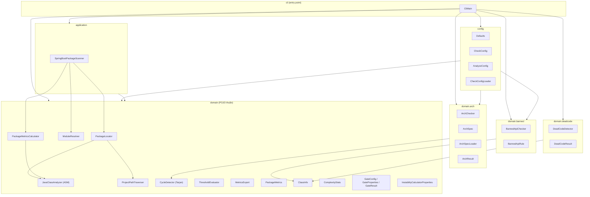
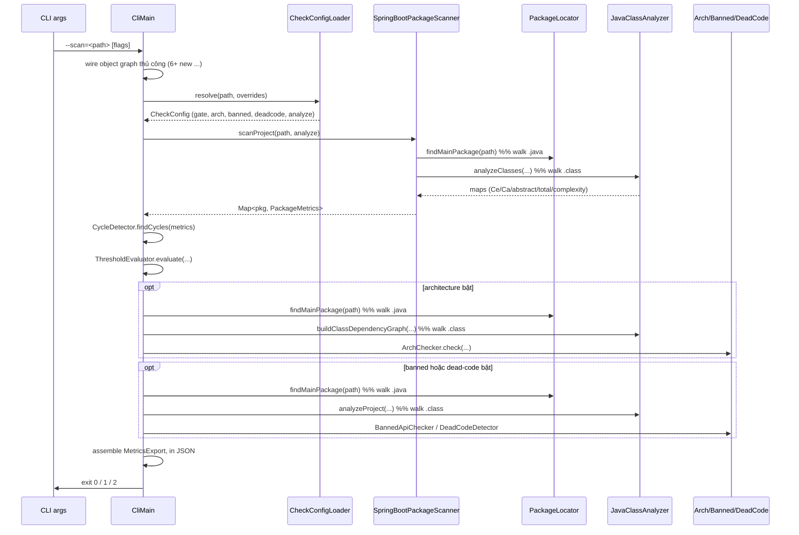
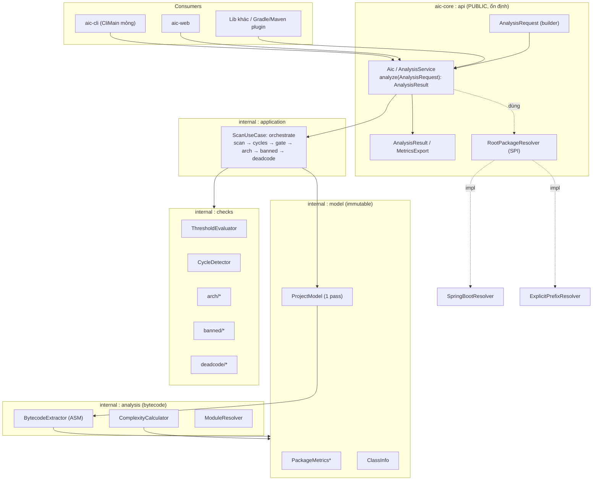

# Đánh giá kiến trúc `aic-core`

> Tài liệu review kiến trúc module `aic-core` — engine phân tích bytecode (Spring-free) của dự án **aic**.
> Phạm vi: chỉ module `core/` (không bao gồm `web/`). Đối chiếu với **chuẩn thiết kế của một thư viện (library)** vì `aic-core` được đóng gói vừa là lib (`aic-core`) vừa là CLI (`aic-cli.jar`).
>
> Ngày: 2026-06-16

---

## 1. Tóm tắt nhanh (Executive summary)

`aic-core` là một engine phân tích metrics gói (package metrics của Robert Martin) đọc trực tiếp `.class` bytecode bằng ASM, **không phụ thuộc Spring**. Thiết kế nền tảng **khá tốt**: tách lớp rõ ràng, các thuật toán thuần (pure logic) dễ test, kết quả là immutable records, cấu hình phân tầng (defaults < project yaml < CLI flags).

Tuy nhiên, **xét theo chuẩn của một thư viện công khai**, có một số điểm chưa hợp lý cần xử lý trước khi `aic-core` thực sự "dùng được như lib": chưa có **public API facade ổn định**, `groupId/package` còn là placeholder `com.example` (không publish được), `JavaClassAnalyzer` là **God class**, trộn lẫn **đọc source `.java`** với **đọc bytecode**, bị **hardcode vào Spring Boot**, và engine **quét toàn dự án nhiều lần** (3 lần walk ASM + nhiều lần tìm main package).

| Khía cạnh | Đánh giá |
|---|---|
| Tách lớp domain/application/cli | 🟢 Tốt |
| Pure logic dễ test | 🟢 Tốt |
| Immutability của kết quả | 🟡 Một phần (records tốt, nhưng `PackageMetrics` mutable) |
| Public API cho consumer dùng lib | 🔴 Chưa có facade, phải tự wire |
| Coordinates/metadata để publish | 🔴 `com.example`, thiếu metadata POM |
| Single Responsibility | 🔴 `JavaClassAnalyzer` quá tải |
| Decoupling khỏi framework | 🔴 Hardcode `@SpringBootApplication` |
| Hiệu năng (số lần quét) | 🟡 Lặp lại nhiều pass |

---

## 2. Cấu trúc hiện tại

### 2.1. Sơ đồ package & phụ thuộc



**Nhận xét nhanh từ sơ đồ:** `config` lại phụ thuộc ngược vào `domain.arch` / `domain.banned` (vì `CheckConfigLoader` parse YAML thành các object domain). `cli` biết về **tất cả** các package — vì toàn bộ orchestration nằm trong `CliMain.main()`.

### 2.2. Luồng một lần scan (CLI)



> 👉 Điểm cần chú ý: tới **3 lần `Files.walk` toàn bộ `.class`** và tới **3 lần `findMainPackage`** (mỗi lần lại walk `src/main/java` đọc text từng file). Với dự án lớn đây là chi phí I/O + ASM lặp lại đáng kể.

---

## 3. Điểm hợp lý (giữ nguyên)

1. **Spring-free core thật sự.** `domain` + `application` là POJO thuần, chỉ phụ thuộc ASM / Jackson / SLF4J / SnakeYAML. Đây là điều kiện tiên quyết để là một lib tốt — và dự án làm đúng (web module mới gắn Spring qua `@Bean`). 🟢
2. **Pure logic tách khỏi I/O.** `ThresholdEvaluator`, `ArchChecker`, `BannedApiChecker`, `DeadCodeDetector`, `CycleDetector` đều không đụng filesystem → unit test trực tiếp, rất dễ kiểm thử. 🟢
3. **Thuật toán dùng chung.** `CycleDetector.cyclesInGraph` (Tarjan SCC) được tái sử dụng cho cả cycle-gate cấp package lẫn arch-checker. Không trùng lặp. 🟢
4. **Kết quả là immutable records** với pattern `withXxx()` (copy-on-write): `MetricsExport`, `ArchResult`, `DeadCodeResult`, `ClassInfo`, `CheckConfig`, `AnalyzeConfig`. Hợp với một lib (API trả về dữ liệu bất biến). 🟢
5. **Cấu hình phân tầng rõ ràng:** code defaults < `aic-check.yaml` < CLI flags. `Defaults` là một single source of truth được cả CLI và web dùng. 🟢
6. **Dependency injection qua constructor** (trừ legacy trong `JavaClassAnalyzer`). 🟢
7. **Self-describing JSON envelope** (`MetricsExport`) có metadata (thời điểm, version, summary) — đúng kiểu output để hệ thống khác tiêu thụ. 🟢

---

## 4. Điểm CHƯA hợp lý (cần sửa) — đặc biệt theo chuẩn library

### 4.1. 🔴 Chưa có **Public API Facade** — consumer phải tự wire object graph
Một thư viện tốt phải có **một điểm vào ổn định**. Hiện tại để chạy phân tích, consumer phải tự lặp lại đúng đoạn wiring trong `CliMain` (dòng 59–64):

```java
JavaClassAnalyzer analyzer = new JavaClassAnalyzer(Defaults.exclusions());
PackageLocator locator = new PackageLocator(analyzer, new ProjectPathTraverser());
SpringBootPackageScanner scanner = new SpringBootPackageScanner(locator, new PackageMetricsCalculator(analyzer));
CycleDetector cycleDetector = new CycleDetector();
ThresholdEvaluator evaluator = new ThresholdEvaluator();
// ... rồi tự orchestrate gate + arch + banned + deadcode
```

Đây là **kiến thức nội bộ bị rò ra ngoài**: ai dùng lib cũng phải biết thứ tự lắp ráp 6+ object và toàn bộ orchestration. Đây là vi phạm nguyên tắc "encapsulate the wiring" của library design.

### 4.2. 🔴 Toàn bộ **orchestration nằm trong `CliMain.main()`**
"Use case" thật sự — *quét → tìm cycle → đánh giá gate → check arch → check banned → dead-code → gói `MetricsExport`* — đang sống trong `main()`. Hệ quả:
- Không tái sử dụng được (web module phải tự dựng lại một phần logic này).
- Không test được luồng đầy-đủ ở mức core (chỉ test được từng mảnh).
- `cli` package phụ thuộc vào **mọi** package khác.

→ Orchestration này phải nằm ở **application layer** (ví dụ một `AnalysisService` / `AicAnalyzer`) để CLI, web và mọi consumer lib dùng chung.

### 4.3. 🔴 `groupId`/package là placeholder `com.example` — **không publish được**
- `groupId = com.example`, package gốc `com.example.softwaremetrics`. Maven Central **cấm** `com.example`. Một lib phải có coordinates thật (ví dụ `io.github.<user>.aic` / `com.canhnv.aic`).
- POM thiếu metadata bắt buộc để publish: `<name>`, `<url>`, `<licenses>`, `<scm>`, `<developers>`. Thiếu cả nguồn-jar/javadoc-jar plugin.
- Tên package `softwaremetrics` không khớp tên sản phẩm `aic`.

### 4.4. 🔴 `JavaClassAnalyzer` là **God class** (~544 dòng, vi phạm SRP)
Một class đang ôm: phát hiện `@SpringBootApplication` (đọc **text**), trích package từ source, trích dependency từ bytecode, tính cyclomatic complexity, đếm abstract/total, dựng `ClassInfo` model, dựng class-dependency-graph, lọc exclusion, chuẩn hóa array type (3 hàm na ná nhau: `stripArraySuffix`, `normalizeArrayType`, `normalizeArrayClassName`).

→ Nên tách: `BytecodeDependencyExtractor`, `ComplexityCalculator`, `ClassModelBuilder`, `MainPackageDetector`, `TypeNames` (util chuẩn hóa).

### 4.5. 🔴 Trộn **đọc source `.java`** với **đọc bytecode `.class`**
`containsSpringBootApplication()` và `extractPackage()` đọc **text source** (`Files.lines`, regex), trong khi mọi thứ khác đọc bytecode. Điều này:
- Mâu thuẫn với "hợp đồng bytecode" mà CLAUDE.md nhấn mạnh.
- Dễ vỡ (regex bỏ comment/string thủ công), và **annotation `@SpringBootApplication` hoàn toàn có thể đọc từ bytecode** — chính class này đã đọc annotation ở chỗ khác (`ENTRY_ANNOTATION_MARKERS`).

→ Thống nhất: phát hiện main package từ bytecode annotation, bỏ hẳn việc đọc source.

### 4.6. 🔴 Hardcode vào **Spring Boot** trong một lib metrics tổng quát
Metrics của Robert Martin **không liên quan gì tới Spring**. Nhưng cả engine bắt buộc phải tìm `@SpringBootApplication` để xác định "main package", và class tên `SpringBootPackageScanner`. Một dự án Java thuần (hoặc Micronaut/Quarkus) **không scan được**.

→ Trừu tượng hóa thành một `RootPackageResolver` (SPI) với vài chiến lược: theo annotation Spring Boot, theo prefix package do người dùng truyền, hoặc tự suy ra common-prefix. Spring Boot chỉ là **một** implementation.

### 4.7. 🟡 `config` package vừa là **dữ liệu** vừa là **hành vi + I/O**
`config` chứa cả record dữ liệu (`CheckConfig`, `AnalyzeConfig`) lẫn `CheckConfigLoader` (đọc file, parse YAML, ném exception) và lại **phụ thuộc ngược** vào `domain.arch`/`domain.banned`. Việc load/parse là concern của application, không phải "config thuần".

### 4.8. 🟡 Lặp pass quét toàn dự án (hiệu năng)
Như sequence ở §2.2: tới **3 lần walk `.class`** (metrics / arch-graph / class-model) và **3 lần `findMainPackage`** (mỗi lần walk lại `src/main/java`). Có thể gộp thành **một in-memory project model duy nhất** rồi mọi check đọc từ model đó.

### 4.9. 🟡 Bất nhất immutability & naming kiểu Spring rò vào core
- `PackageMetrics` là **mutable bean** (đầy setter) trong khi phần còn lại là record bất biến.
- `InstabilityCalculatorProperties` / `GateProperties` mang phong cách JavaBean getter/setter của Spring config, lọt vào core. Tên `InstabilityCalculatorProperties` thực chất là "danh sách exclusion".
- **Cờ `disabled` bị đảo nghĩa**: `isDisabled()==true` lại nghĩa là filter **đang bật**. Rất khó hiểu cho public API.

### 4.10. 🟡 Linh tinh khác
- `TOOL_VERSION = "1.0-SNAPSHOT"` **hardcode** trong `CliMain` — nên lấy từ manifest/build.
- Comment tiếng Việt + code chết còn sót trong `JavaClassAnalyzer` (`normalizeArrayClassName`, các hàm chuẩn hóa trùng) — đúng như mục "Notes" trong CLAUDE.md.
- Chưa có `module-info.java` (JPMS) dù chạy JDK 22 — không có ranh giới "public API vs internal" được enforce; mọi class public đều lộ ra cho consumer.
- Parse args thủ công trong `CliMain` (đủ dùng nhưng dễ vỡ với edge case).

---

## 5. Đối chiếu chuẩn thiết kế Library

| Tiêu chí library | Hiện trạng | Khoảng cách |
|---|---|---|
| **Public API tối thiểu, ổn định** (facade) | Chưa có; phải tự wire | 🔴 Lớn |
| **Tách API ↔ implementation (internal)** | Mọi thứ public, không JPMS | 🔴 Lớn |
| **Không lệ thuộc framework** | Hardcode Spring Boot | 🔴 Lớn |
| **Coordinates + metadata publish** | `com.example`, thiếu POM meta | 🔴 Lớn |
| **Semantic versioning** | Chỉ `1.0-SNAPSHOT` hardcode | 🟡 |
| **Immutable value objects** | Đa phần OK, trừ `PackageMetrics` | 🟡 |
| **Error handling rõ ràng cho consumer** | Trộn exception + `System.exit` | 🟡 |
| **Cấu hình qua builder/object rõ ràng** | Có records nhưng cờ `disabled` đảo nghĩa | 🟡 |
| **Tài liệu API (Javadoc)** | Javadoc class tốt | 🟢 |
| **Test pure logic** | Rất tốt | 🟢 |

---

## 6. Đề xuất kiến trúc mục tiêu

### 6.1. Sơ đồ kiến trúc đề xuất



`*PackageMetrics` chuyển sang immutable.

### 6.2. Lộ trình đề xuất (ưu tiên giảm dần)

**P0 — Biến core thành "lib thật":**
1. Thêm **facade `AnalysisService`** ở application layer, gói toàn bộ orchestration đang nằm trong `CliMain`. CLI/web chỉ gọi `service.analyze(request)`. (`CliMain` chỉ còn parse args + in JSON + set exit code.)
2. Đưa ra **`AnalysisRequest` (builder)** + **`AnalysisResult`** làm public API tối thiểu; mọi thứ khác đánh dấu internal.
3. Đổi `groupId`/package gốc khỏi `com.example`; bổ sung metadata POM (`name/url/licenses/scm/developers`, source+javadoc jar).

**P1 — Đúng chuẩn & bền vững:**
4. Trừu tượng `RootPackageResolver` (SPI) → bỏ hardcode `@SpringBootApplication`; Spring Boot thành một implementation.
5. Gộp **một project pass duy nhất** → `ProjectModel`, mọi check đọc từ model (bỏ 3 lần walk + 3 lần findMainPackage). Phát hiện main package từ **bytecode** (bỏ đọc source `.java`).
6. Tách `JavaClassAnalyzer` thành các class theo SRP; gộp 3 hàm chuẩn hóa array làm một util `TypeNames`.

**P2 — Polish:**
7. `PackageMetrics` → immutable record; thống nhất naming (`ExclusionFilters` thay cho `InstabilityCalculatorProperties`); sửa cờ `disabled` đảo nghĩa thành `enabled`.
8. Thêm `module-info.java` (JPMS) export đúng package `api`, giấu internal.
9. Lấy version từ manifest thay cho hardcode; dọn code chết/comment tiếng Việt trong `JavaClassAnalyzer` (xem `/clean-debug`).
10. Cân nhắc trả lỗi qua kiểu kết quả (Result) thay vì để consumer phải bắt `IllegalArgument/IllegalState`.

---

## 7. Kết luận

Nền tảng kiến trúc của `aic-core` **vững** ở chỗ quan trọng nhất với một engine phân tích: Spring-free, pure logic dễ test, kết quả bất biến, cấu hình phân tầng. Khoảng cách chính so với **chuẩn của một thư viện** là ở *bề mặt API và sự đóng gói*: cần một **facade ổn định** + đưa **orchestration ra khỏi `CliMain`**, **tách rời Spring Boot**, đặt **coordinates publish thật**, và **gộp các pass quét**. Làm xong nhóm P0–P1, `aic-core` sẽ thực sự là một lib dùng lại được, không chỉ là "engine sau lưng CLI/web".
