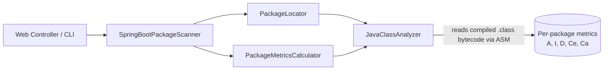

# Abstractness & Instability Calculator

A tool that computes Robert C. Martin's package design metrics — **Abstractness (A)**, **Instability
(I)**, and **Distance from the Main Sequence (D)** — for Java / Spring Boot projects, and enforces
architecture quality. It ships both an **interactive web UI** and a **headless CLI** that can gate a
build in CI when package design regresses.

It follows the [Spring Modulith](https://docs.spring.io/spring-modulith/reference/fundamentals.html#modules.simple)
idea of *application module packages* — the direct sub-packages of the package that holds the
`@SpringBootApplication` class.

## Features

- **Web UI** — scan a project and explore an interactive scatter plot of abstractness vs. instability, with a dark theme for presentations.
- **Per-package metrics** — A, I, D plus Ce/Ca couplings.
- **Dependency visualization** — interactive force-directed graph of each package's dependencies.
- **Circular dependency detection** — finds package cycles (Tarjan SCC) and flags them in the UI, the JSON output, and as a CI gate.
- **JSON export** — `GET /api/metrics` or an in-browser button emits a self-describing metrics envelope.
- **Headless CLI + CI quality gates** — fail a build when architecture quality regresses (distance / zones / average / cycles).
- **Architecture conformance** — enforce a YAML architecture spec (layered, hexagonal, onion, or your own).

## How a scan works

The analyzer reads **compiled `.class` bytecode** (via ASM), so the target project must be built first.

## Where to next

- [Getting Started](getting-started.md) — build and run the web app or the CLI.
- [Understanding the Metrics](metrics.md) — what A, I, D mean and how to read the chart.
- [CLI & CI Gates](cli-and-ci.md) — fail a build on architectural regressions.
- [Architecture Checks](architecture-checks.md) — enforce a layered/hexagonal/onion (or custom) design.
