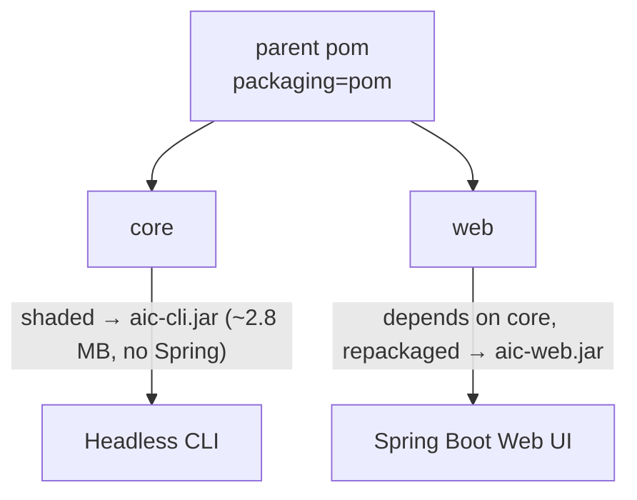

# Project Structure

A multi-module Maven build splits the lean analysis engine from the web UI.

## `core` — analysis engine + CLI (Spring-free)

Plain Java (no Spring); dependencies are only ASM, Jackson, slf4j, and snakeyaml.

- `domain` — the analysis core:
    - `JavaClassAnalyzer` — reads `.class` bytecode (ASM) to extract dependencies and class counts.
    - `PackageLocator` / `ProjectPathTraverser` — find the main package and module packages.
    - `PackageMetricsCalculator` / `PackageMetrics` — aggregate into per-package A/I/D, Ce/Ca.
    - `CycleDetector` — Tarjan SCC over the package graph.
    - `GateConfig` / `ThresholdEvaluator` — quality gates.
    - `arch/` — `ArchSpec`, `ArchSpecLoader`, `ArchChecker` (YAML-driven conformance).
    - `MetricsExport` — the JSON envelope.
- `application` — `SpringBootPackageScanner` orchestrates a scan.
- `cli` — `CliMain` wires the POJOs by hand and runs the headless scan.
- `config` — `Defaults` (exclusion lists + default gate config).

## `web` — Spring Boot UI

Depends on `core`. `config/AnalysisConfig` exposes the core POJOs as `@Bean`s and binds
`application.yaml` onto them via `@Bean @ConfigurationProperties`, so `core` stays Spring-free while
the web app stays YAML-configurable. `infrastructure/PackageScannerController` serves `GET /`,
`POST /scan`, and `GET /api/metrics`; templates live in `web/src/main/resources/templates/`.

## The bytecode contract

Everything that reads a target project assumes **compiled `.class` files** — the analyzer never parses
source. Compile the target before scanning. Exclusion lists (JDK/native packages, common libraries,
basic types) keep only first-party coupling in the metrics.
